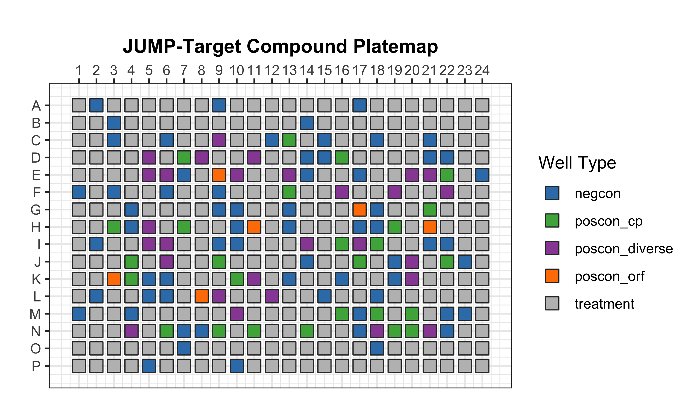
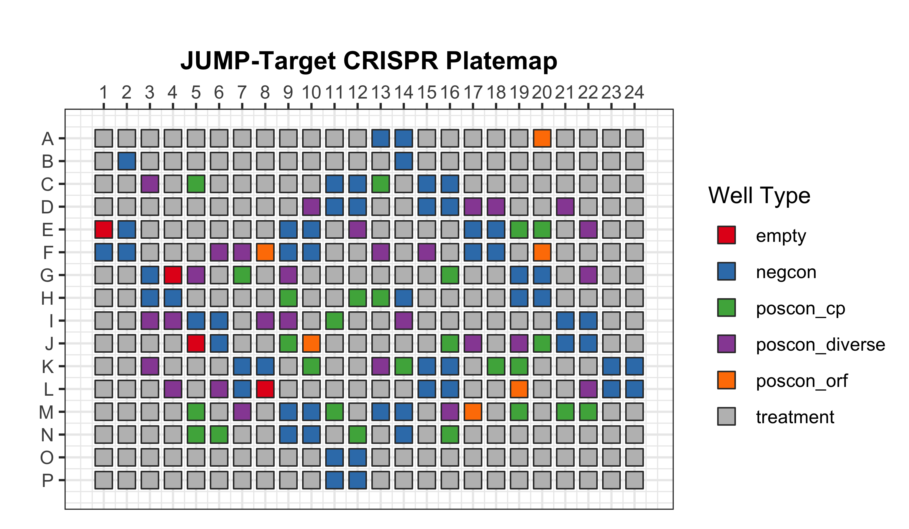
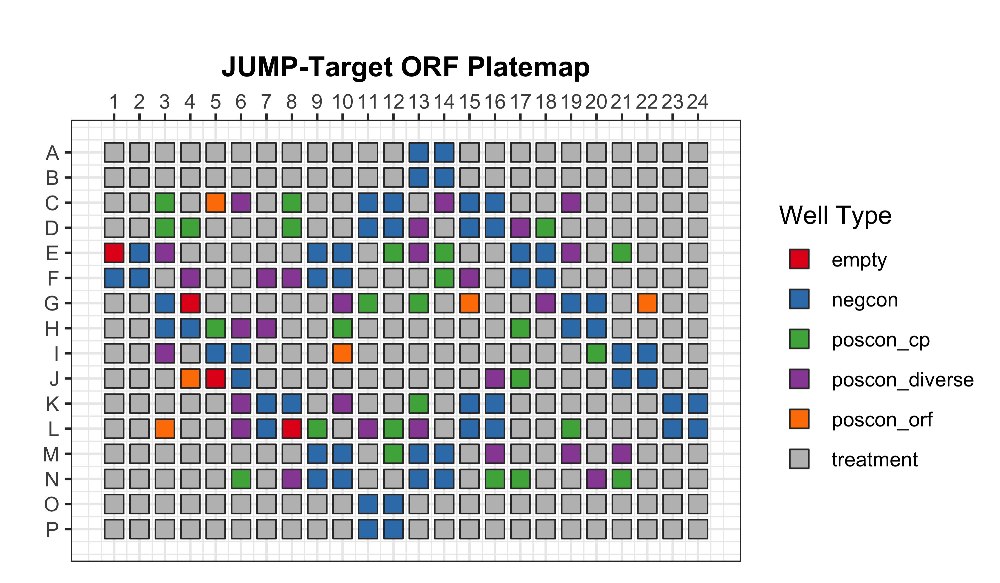

# Barcode Platemap and Platemaps

In this folder, there three file types:

1. **Barcode plate** - CSV file that associates each plate to the correct platemap
2. **Platemap** - TXT that contains the plate layout (e.g., what broad sample is in what well)
3. **Metadata** - TSV file that contains all of the relevant metadata per broad sample

The platemap and metadata files are broken down by treatment (e.g., compound, crispr, or orf).

Metadata files were downloaded from [the metadata folder in AWS](https://cellpainting-gallery.s3.amazonaws.com/index.html#cpg0000-jump-pilot/source_4/workspace/metadata/external_metadata/).
Barcode platemap and platemap files where downloaded from [the platemaps folder in AWS](https://cellpainting-gallery.s3.amazonaws.com/index.html#cpg0000-jump-pilot/source_4/workspace/metadata/platemaps/2020_11_04_CPJUMP1/).

Visualization of the platemaps are as follows:

> Platemap for compound treatments

> Platemap for crispr treatments

> Platemap for orf treatments