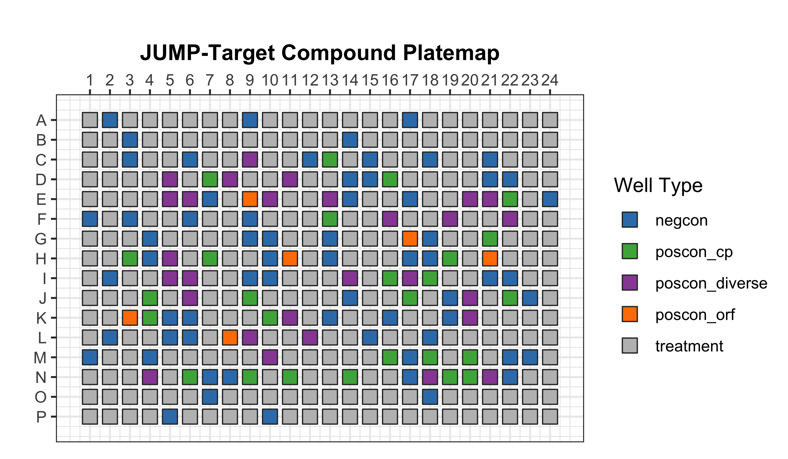
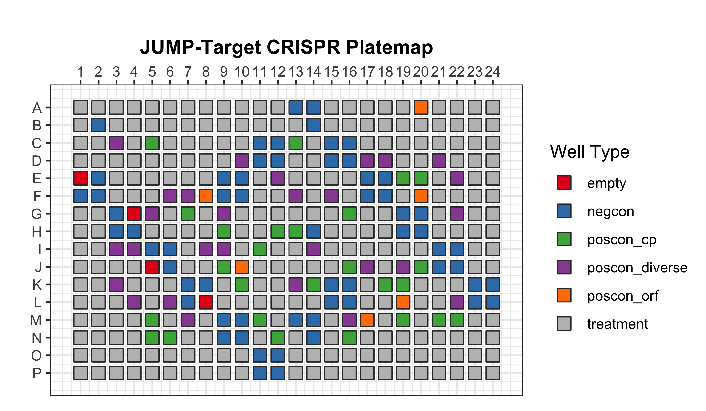
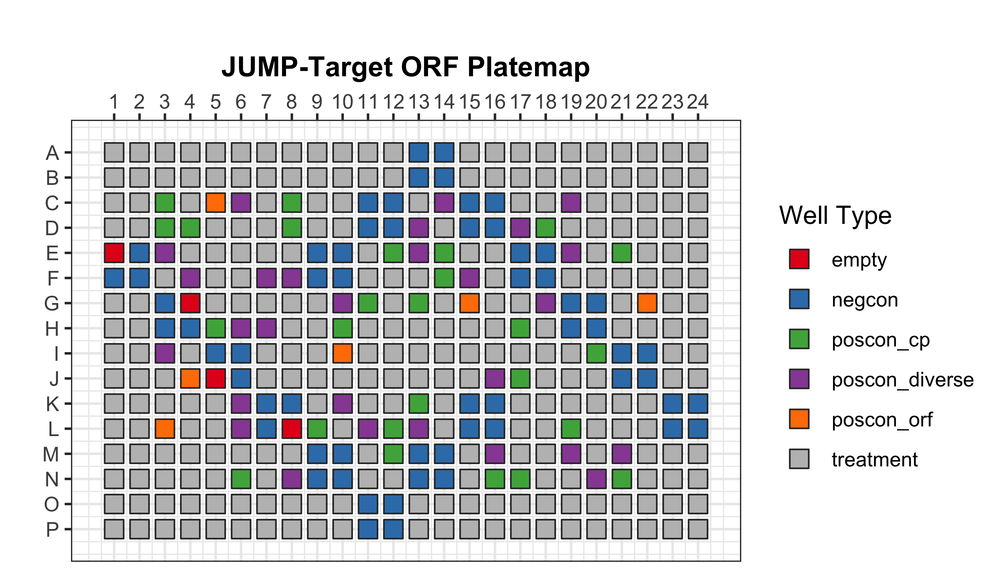

# Barcode Platemap and Platemaps

In this folder, there are four file types:

1. **Barcode plate** - CSV file that associates each plate with the correct platemap
2. **Platemap** - TXT file that contains plate layout information (for example, which Broad sample is in each well)
3. **Metadata** - TSV file that contains all of the relevant metadata per broad sample
4. **Experimental Metadata** - TSV file that contains additional information about the experiment

The platemap and metadata files are broken down by treatment (for example, compound, CRISPR, or ORF).

We downloaded metadata files excluding the **Experimental Metadata** from [the metadata folder in AWS](https://cellpainting-gallery.s3.amazonaws.com/index.html#cpg0000-jump-pilot/source_4/workspace/metadata/external_metadata/).
We downloaded the barcode platemap and platemap files from [the platemaps folder in AWS](https://cellpainting-gallery.s3.amazonaws.com/index.html#cpg0000-jump-pilot/source_4/workspace/metadata/platemaps/2020_11_04_CPJUMP1/).
We downloaded the experimental metadata file from [the jump-cellpainting github repo subfolder](https://github.com/jump-cellpainting/2023_Chandrasekaran_submitted/blob/9edd26d60524a62f993d4df40a5d8908206714f5/README.md#batch-and-plate-metadata).

Platemap visualizations are shown below:

> Platemap for compound treatments

> Platemap for CRISPR treatments

> Platemap for ORF treatments
